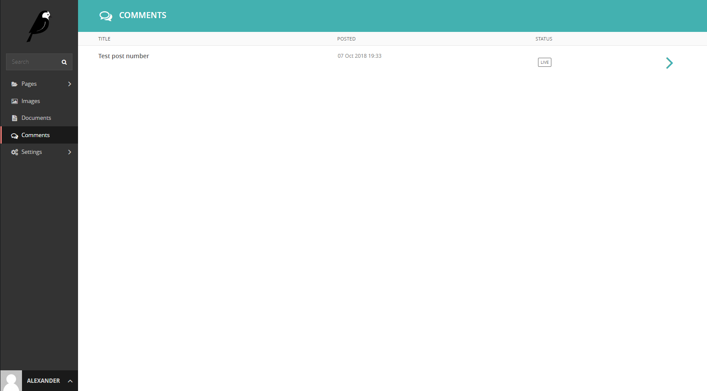
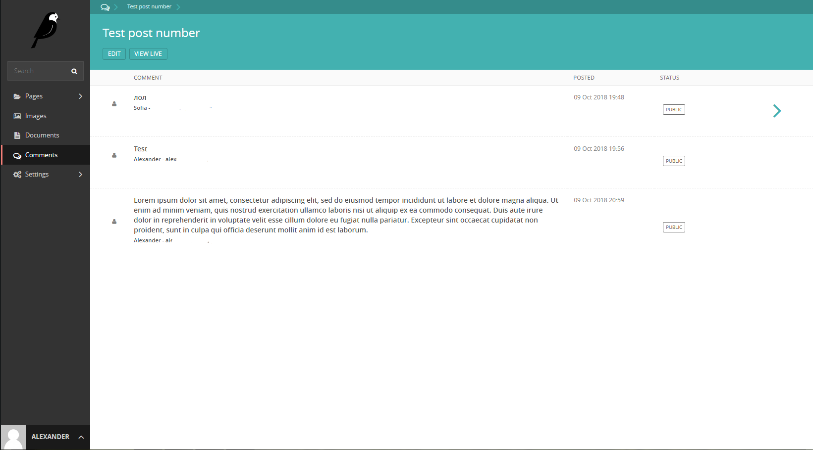

# Wagtail Comments

This module allows you to manage [django-comments-xtd](https://github.com/danirus/django-comments-xtd) comments into the Wagtail admin UI. Tested on Wagtail 2.2.








## Instructions

`pip install git+https://github.com/AlexDeltax/wagtail_comments_xtd.git`

Add `'wagtail_comments_xtd'` to your INSTALLED_APPS

Add `'wagtailfontawesome'` to INSTALLED_APPS if it's not there already

### Settings

1. Enable the "sites" framework &lt;enabling-the-sites-framework&gt; by adding `'django.contrib.sites'` to INSTALLED\_APPS and defining SITE\_ID. Visit the admin site and be sure that the domain field of the `Site` instance points to the correct domain (`localhost:8000` when running the default development server), as it will be used to create comment verification URLs, follow-up cancellations, etc.
2. Add `'django_comments_xtd'` and `'django_comments'`, **in that order**, to INSTALLED\_APPS.
3. Set the COMMENTS\_APP setting to `'django_comments_xtd'`.
4. Set the COMMENTS\_XTD\_MAX\_THREAD\_LEVEL to `N`, being `N` the maximum level of threading up to which comments will be nested in your project.

    ``` sourceCode
    # 0: No nested comments:
    #  Comment (level 0)
    # 1: Nested up to level one:
    #  Comment (level 0)
    #   |-- Comment (level 1)
    # 2: Nested up to level two:
    #  Comment (level 0)
    #   |-- Comment (level 1)
    #        |-- Comment (level 2)
    COMMENTS_XTD_MAX_THREAD_LEVEL = 2
    ```

    The thread level can also be established on a per `<app>.<model>` basis by using the COMMENTS\_XTD\_MAX\_THREAD\_LEVEL\_BY\_APP\_MODEL setting. Use it to establish different maximum threading levels for each model. ie: no nested comments for quotes, up to thread level 2 for blog stories, etc.

5. Set the COMMENTS\_XTD\_CONFIRM\_EMAIL to `True` to require comment confirmation by email for no logged-in users.
6. Run `manage.py migrate` to create the tables.
7. Add the URLs of the comments-xtd app to your project’s `urls.py`:

    ``` sourceCode
    urlpatterns = [
        ...
        url(r'^comments/', include('django_comments_xtd.urls')),
        ...
    ]
    ```

8. Customize your project’s email settings:

    ``` sourceCode
    EMAIL_HOST = "smtp.mail.com"
    EMAIL_PORT = "587"
    EMAIL_HOST_USER = "alias@mail.com"
    EMAIL_HOST_PASSWORD = "yourpassword"
    DEFAULT_FROM_EMAIL = "Helpdesk <helpdesk@yourdomain>"

9. Now go to your models.py and add:
    
    ```
    class BlogPost(Page):
        ...
        ...
        @property
        def blog_index(self):
            return self.get_ancestors().type(BlogCategory).last()

        def get_absolute_url(self):
            return self.full_url
        ...
    ```
    Change BlogCategory and BlogPost to yours.

10. Open you.web.site/django-admin/ and got to Sites. Check if there everything is okay.

